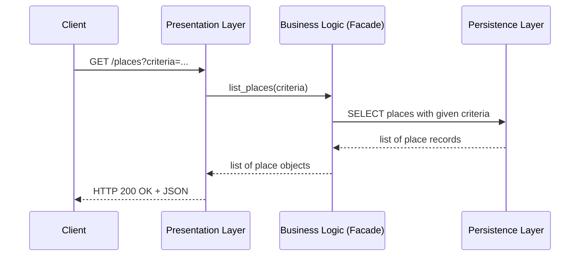

```mermaid
sequenceDiagram
    participant Client
    participant API as Presentation Layer
    participant Facade as Business Logic (Facade)
    participant DB as Persistence Layer

    Client->>API: GET /places?criteria=...
    API->>Facade: list_places(criteria)
    Facade->>DB: SELECT places with given criteria
    DB-->>Facade: list of place records
    Facade-->>API: list of place objects
    API-->>Client: HTTP 200 OK + JSON

```
